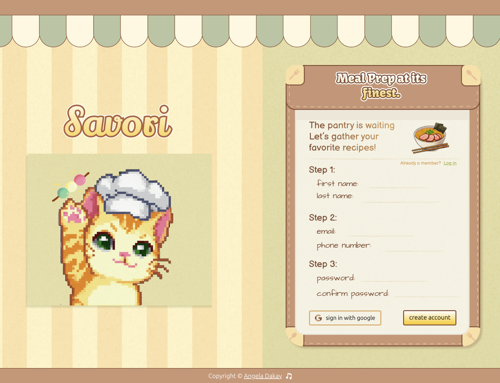

# 🥗 Sign-Up Form

A cozy little landing page I made with a meal prep theme!  
As part of the odin project, practicing the use of HTML forms: focused on visuals, form validation, and adding some personality through pixel art and styling.

## ✨ What’s inside

- A custom-designed form with clean layout and cute UI
- Input validation with soft warning feedback
- Pastel color palette with cozy food vibes
- Responsive-ish layout that works on larger screens

## 🧰 Built with

- Pure HTML + CSS  
- Javascript

## 🖼️ Preview

## 🎧 Bonus

Includes optional background café music and a waving pixel cat mascot to make the experience feel warm and welcoming.
